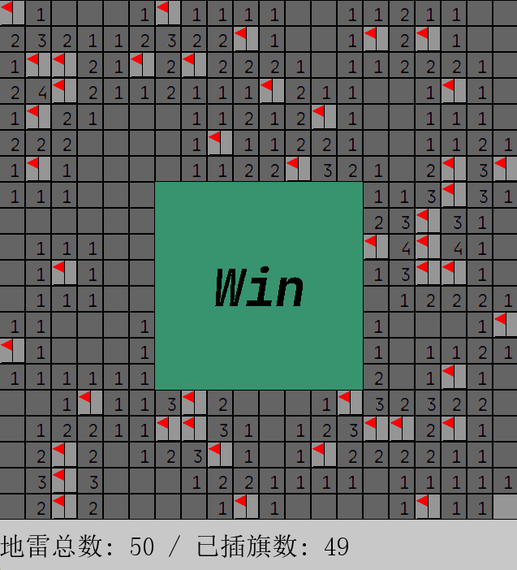

# 基于 SDL2 的扫雷

该仓库是对[这个项目](https://github.com/VisualGMQ/mine-sweep-SDL2)的复刻，并在此基础上进行了一些修改：

1. 优化了地雷数量的生成方式

   - 改变了 Tile.type 的数据结构（union）
   - 遍历每一个地雷来生成地雷数量（而非遍历每一个非地雷的方块）

2. 使用栈来实现 FloodFill 算法，而非递归

3. 增加了左右键双击的功能

4. 增加了地雷、旗帜的计数功能

## 操作方式

鼠标左键翻开格子，右键插旗子，左右键同时自动翻开格子（条件允许下）。

显示出失败/胜利图标后再次点击鼠标可以重开一局。

## 运行截图

